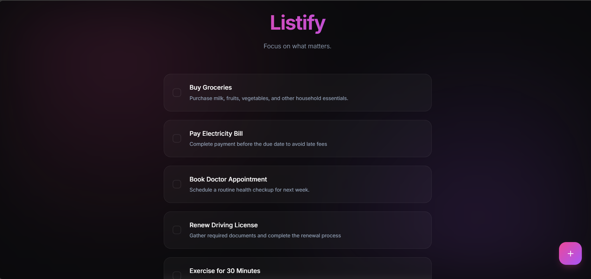

# Listify 📝

A modern full-stack task management application built with **HTML, CSS, JavaScript, Node.js, Express.js, and MongoDB**.

Listify provides a clean and responsive interface for creating, managing, and tracking tasks while implementing core full-stack development concepts including API integration, database operations, frontend-backend communication, and structured application architecture.



---

## ✨ Features

* Create new tasks
* Update task status
* Delete tasks
* Persistent data storage using MongoDB
* RESTful API integration
* Responsive user interface
* Modern dark-themed design

---

## 🛠️ Tech Stack

### Frontend

* HTML
* CSS
* JavaScript

### Backend

* Node.js
* Express.js

### Database

* MongoDB

---

## 🏗️ Architecture

The application follows a structured full-stack architecture with clear separation of responsibilities:

* **Frontend Layer** — User interface and client-side interactions
* **API Layer** — Handles requests and responses between client and server
* **Controller Layer** — Business logic and request processing
* **Model Layer** — Data representation and database operations
* **Database Layer** — MongoDB for persistent storage

This structure improves maintainability, scalability, and code organization.

---

## 📚 Key Engineering Concepts

### Requirements Thinking

Designed around a clear task management workflow with focus on usability, simplicity, and maintainability.

### Data Modelling

Tasks are represented through structured data models, enabling consistent creation, retrieval, updates, and deletion across the application.

### Frontend–Backend Communication

Implemented API-driven communication between the client and server, allowing seamless interaction with backend services and database operations.

### Application Architecture

Organized using separation of concerns, ensuring that user interface, business logic, routing, and data management remain independent and maintainable.

### Debugging & Problem Solving

Development involved diagnosing issues related to state management, API communication, data flow, and frontend-backend synchronization.

### AI-Assisted Development

AI development tools were used to assist implementation, debugging, UI refinement, and iteration while maintaining ownership of architecture, requirements, and engineering decisions.

---

## 📂 Project Structure

```text
LISTIFY
│
├── assets
│   └── Screenshot.png
│
├── frontend
│   ├── index.html
│   ├── script.js
│   └── style.css
│
├── src
│   ├── controllers
│   │   └── taskController.js
│   │
│   ├── models
│   │   └── Task.js
│   │
│   └── routes
│       └── taskRoutes.js
│
├── app.js
├── package.json
├── package-lock.json
├── .env
├── .gitignore
└── PROJECT_PLAN.md
```

---

## 🚀 Future Improvements

* User authentication and authorization
* Task categories and labels
* Due dates and reminders
* Search and filtering
* Deployment
* Enhanced validation and error handling

---

## 📬 Contact

**Email:** [kananpreetkaur01@gmail.com](mailto:your-email@example.com)

**LinkedIn:** https://www.linkedin.com/in/kanan-preet-kaur/

---

## 🔗 Repository

GitHub Repository:

https://github.com/kanan-preet-kaur/listify
